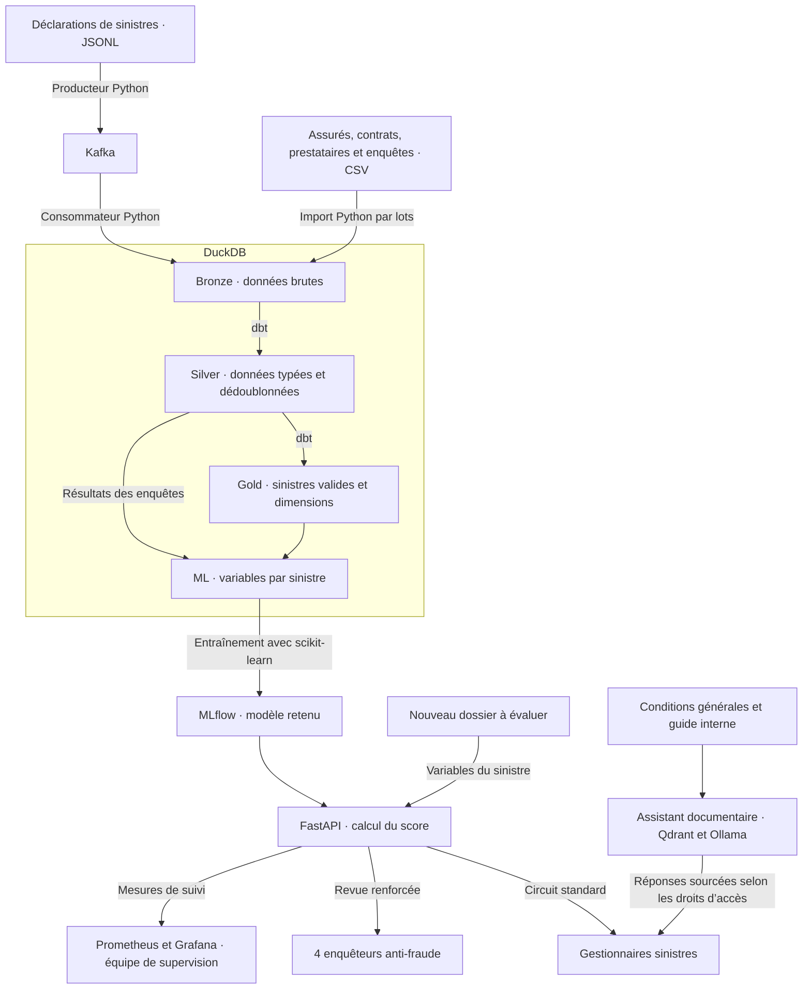

# Mutuelle Alpine Assurances — Architecture cible

```mermaid
flowchart TD
    events["Déclarations de sinistres · JSONL"] -->|Producteur Python| kafka["Kafka"]
    kafka -->|Consommateur Python| bronze
    csv["Assurés, contrats, prestataires et enquêtes · CSV"] -->|Import Python par lots| bronze

    subgraph duck["DuckDB"]
        bronze["Bronze · données brutes"] -->|dbt| silver["Silver · données typées et dédoublonnées"]
        silver -->|dbt| gold["Gold · sinistres valides et dimensions"]
        gold --> features["ML · variables par sinistre"]
        silver -->|Résultats des enquêtes| features
    end

    features -->|Entraînement avec scikit-learn| model["MLflow · modèle retenu"]
    model --> api["FastAPI · calcul du score"]
    dossier["Nouveau dossier à évaluer"] -->|Variables du sinistre| api
    api -->|Circuit standard| gestion["Gestionnaires sinistres"]
    api -->|Revue renforcée| enquete["4 enquêteurs anti-fraude"]
    api -->|Mesures de suivi| suivi["Prometheus et Grafana · équipe de supervision"]

    docs["Conditions générales et guide interne"] --> assistantDoc["Assistant documentaire · Qdrant et Ollama"]
    assistantDoc -->|Réponses sourcées selon les droits d’accès| gestion
```
